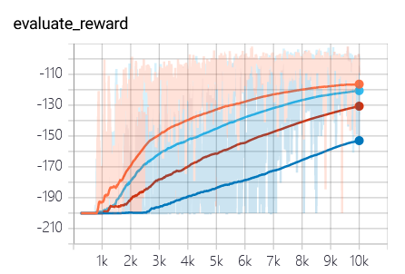
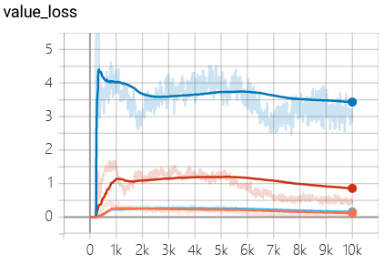

# Prioritized n-step Double DQN

PyTorch implementation of n-step double DQN with prioritized replay memory.

### Experiments

- MoutainCar-V0
  - orange, light blue: step = 1
  - red: step = 5
  - blue: step = 10

- Acrobot-v1
  - n-step from up to bottom: 10, 5, 3, 1

### Requirements
- PyTorch==1.7.0
